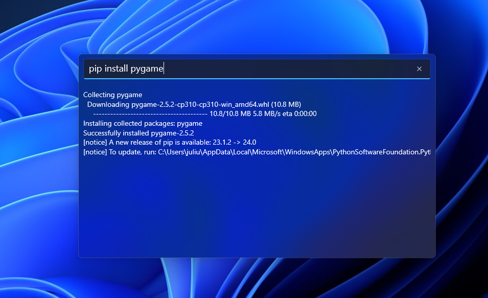
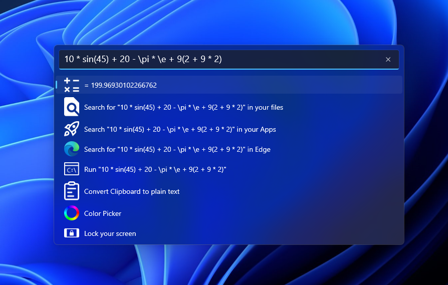

    
 
 
 <h1  align="center">QuickNav</h1>

    
    
    

>### Shortcut: **Windows + Y**

## 🤔 What is QuickNav?
QuickNav is a powerful Windows tool that simplifies multitasking with just a keystroke. By pressing a Windows + Y, a search window pops up, allowing users to perform various tasks such as searching the web, finding files, running commands, and more. Currently in progress, QuickNav aims to enhance productivity and streamline user interaction with their system.

## 📥Download

## 🛠️ Features
- Live advanced calculator with functions such as sin, cos, tan, e, pi, and support for repeated calculations like 10 + 10 * 50 - 20 *(5 + 10)
- File search
- Commandline executor
- File info
- Start Apps
- System information
- Lock screen
- Web search
- Clipboard to Plain text
- Timer
- Word Counter
- Color chooser (more like a color selector than a picker)

## 👨‍💻 Contribute to QuickNav
- **Code Contributions:** Fork the repository, make enhancements, and submit pull requests on GitHub.
- **Bug Reports:** Help us by reporting any issues or bugs you encounter on our GitHub repository.
- **Feature Requests:** Share your ideas for new features or improvements.
- **Feedback:** We value your feedback! Let us know your thoughts and suggestions to help us improve QuickNav.

## 🚀 Get Started
1. Clone the repository.
2. Ensure you have the necessary dependencies for C# development in Visual Studio.
3. Open the .sln file in the root folder.
4. Build and run QuickNav in Visual Studio.

## 📸 Screenshots

